# Product Playbook: Build with Discipline in the AI Era

[](LICENSE)
[](CHANGELOG.md)


**A guided path from idea -> shipped that bakes in the engineering discipline most teams learn the hard way.**

---

## 📖 The Personal Story: The Vibe Coding Trap

In this AI era, everyone is building a product. I did too.

Armed with tools like Claude Code, Cursor, and Copilot, I was coding at 100mph. I felt like a superhero. I was spinning up files, adding features in minutes, and generating entire modules with single prompts. We call it "vibe coding." It feels like magic:until the vibe fades and reality hits.

Suddenly, I found myself staring at a product that was slipping away from me. I was completely lost.

Here is exactly how it happened:
1.  **I let features creep in that nobody needed:** Because the AI made building so easy, I kept adding "cool" ideas. Soon, the core purpose of my app was buried under a mountain of secondary features.
2.  **I trusted config settings that silently did nothing:** The AI generated configuration blocks that were silently overridden upstream. Everything looked correct in the files, but the value never flowed end-to-end.
3.  **I relied on green tests while the app was dead in production:** My test suites were passing perfectly, but the actual critical path the product ran on was completely broken because of decoupled runtime wiring.
4.  **I hardcoded vendor APIs directly into my business logic:** I let the AI wire code straight to a specific vendor's SDK. When I needed to swap providers, I had to touch and refactor half the codebase.
5.  **I accidentally exposed secrets and skipped tenant isolation:** A missing security filter almost let users see another customer's data, and placeholder keys were constantly in danger of being committed.

**The Lesson I Learned:** AI is an incredible *execution engine*, but it is not a *discipline engine*. If you build without guardrails, AI doesn't just build your product:it multiplies the entropy, debt, and chaos at 100mph.

To cut short the time of my next project and stay laser-focused, I needed a playbook. Not just a document, but **executable skills with evidence-based gates and checks** that force both me and the AI to maintain engineering discipline.

> 👉 *Short on time? **[Skip the story : jump straight to the 19 skills ->](#skill-reference)***

`product-playbook` was born from my scars. It turns those lessons into a single, shared rulebook (`PRINCIPLES.md`) and maps them to **19 step-by-step commands (skills)** (17 journey phases + the `/frontend-audit` and `/new-component` UI-suite skills). It forces you to move one phase at a time, checking gates with evidence before writing code, so you get senior-level discipline by default.

---

## ⚙️ How it Works: The Files and Principles

This system relies on three core files to create a structured, sequential, yet standalone development workflow.

<picture>
  <source media="(prefers-color-scheme: dark)" srcset="docs/diagrams/architecture-dark.svg">
  
</picture>

<sub>Diagram source: <a href="docs/diagrams/architecture.mmd"><code>docs/diagrams/architecture.mmd</code></a> (regenerate with <code>sh tools/render-diagrams.sh</code>).</sub>

### 1. The Living Spine (`PRODUCT.md`)
Every project gets a single file at its root called `PRODUCT.md` (instantiated from `templates/PRODUCT.md`). This file is the **shared memory** of the product.
*   Every phase reads the prior section for context and appends/updates its own section.
*   If a section is empty, that phase is incomplete.
*   It travels with your Git repo, ensuring anyone (or any new LLM session) can read it top-to-bottom to understand the product's vision, decisions, contracts, and learnings.

### 2. The Rulebook (`PRINCIPLES.md`)
The single source of truth for your quality bar. It details:
*   **The 5-Step Spine:** Architect first , Verify assumptions , No hardcoding , Benchmark to the current year , Self-review.
*   **Per-Feature Contracts:** Explicit exit criteria, interaction maps, and independent test plans.
*   **Production Safeguards:** Zero-secrets, fail-closed security, observability, and rollback paths.

### 3. The Commands (`commands/*.md`)
These are **19 custom Markdown commands** (skills) that you install into Claude Code. Each command (e.g., `/vision`, `/scope`, `/architect`, `/dev-check`) has a strict contract:

```markdown
---
name: vision
description: Phase 1 (Product) of product-playbook.
---
# `/vision` : Phase 1 , Product

## Contract
- **Purpose:** turn a rough idea into a sharp, benchmarked product vision.
- **Reads:** nothing / existing codebase.
- **Writes:** PRODUCT.md#Vision
- **Exit criteria:**
  - [ ] A single sentence vision.
  - [ ] Named target user + job-to-be-done.
  - [ ] North-star success metric.
  - [ ] Verified current-year market read.
```
*(Abridged : the real skill also captures the value proposition, riskiest assumption, business model, and whether it's an AI product.)*

When you run `/playbook` or an individual command, the AI is instructed to:
1.  Verify the prior gate's exit criteria.
2.  Follow the guided checklist.
3.  Perform research/evaluations (e.g., web searches for competitors, security reviews).
4.  Write results back to `PRODUCT.md`.
5.  **Stop at the gate** and wait for your explicit confirmation before moving forward.

---

## 🗺️ The Playbook Journey

Run `/playbook` to start. It reads your `PRODUCT.md` and guides you step-by-step through:

```
START -> /playbook (guides you through the phases below)

1. PRODUCT       /vision ──> /scope ──> /plan
2. DEVELOPMENT   /architect ──> /structure ──> /design-system* ──> /foundation ──> /contracts ──> /tickets ──> /build ──> /dev-check
                                              (* if the product has a UI)
3. TESTING       /test
4. EVALUATION    /eval
5. SHIP          /ship
6. LEARN         /learn

ANYTIME          /drift-check (detects scope creep or code-docs drift)
```

### Skill Reference

| Group | Skill | What it does | Output produced | Use it when |
|---|---|---|---|---|
| **Start** | `/playbook` | Guided entry-point that orchestrates phases | Routes only | You are starting fresh or unsure of the next step |
| **Product** | `/vision` | Sharpens who it's for, the problem, and the job they need done : vs the market | `PRODUCT.md` -> **Vision** | Starting a brand-new project |
| **Product** | `/scope` | Locks down **one** core feature; lists Deferred and Non-goals | `PRODUCT.md` -> **Scope** | Defining MVP / fighting feature creep |
| **Product** | `/plan` | Core-first milestones + concern-area checklists | `PRODUCT.md` -> **Plan** | Creating the roadmap |
| **Dev** | `/architect` | Chooses stack, records ADRs, wraps externals in adapters | `PRODUCT.md` -> **Architecture** | Before writing any code |
| **Dev** | `/structure` | Scaffolds directory layout + root scaffolding; `app/prompts/` for AI | File tree + `STRUCTURE.md` | The first coding step |
| **Dev** | `/design-system` | (UI products) Derives design principles -> confirmed sample page -> archetype-correct `DESIGN.md` (shadcn tokens). Kills the generic AI look; fixes too-small fonts | `DESIGN.md` + sample page + `PRODUCT.md` -> **Design** | Before building any screens |
| **Dev / UI** | `/frontend-audit` | (UI products) Mechanically enforces the design-system laws : a real OKLCH->WCAG contrast engine + token/motion/font/responsive checks; CI-friendly | Pass/warn/error scorecard (exits non-zero on error) | After building or changing UI, or in CI |
| **UI suite** | `/new-component` | (bundled support skill) Builds/skins ONE React component against the `DESIGN.md` tokens : CSS-vars, interactive states, a11y; reuses shadcn/ui + 21st.dev | Component file | Building any UI component |
| **Dev** | `/foundation` | Builds walking skeleton with logging, config, pre-commit and CI | Running app + CI workflows | Bootstrapping the codebase |
| **Dev** | `/contracts` | Writes typed schemas/migrations BEFORE business logic | Schema files + migrations | Writing data layers |
| **Dev** | `/tickets` | Splits each milestone into 2-4 layer-scoped tickets (data / service / UI / tests) that different developers can merge as separate PRs : exact file paths, typed in/out, security DoD. Given a description instead, logs ONE ad-hoc bug against the owning file | `docs/issues/*` + issue/PR templates | After `/contracts`, before building; or any time you spot a bug |
| **Dev** | `/build` | Implements feature with testable exit criteria and docs | Feature code + `docs/features/*` | Building feature-by-feature |
| **Dev** | `/dev-check` | Verifies exit criteria and security DoD with evidence | `PRODUCT.md` -> **Dev-complete** | Prior to testing |
| **Testing** | `/test` | Performs unit/integration/regression and adversarial tests | Test suites | Post-development check |
| **Eval** | `/eval` | Measures quality and latencies against baseline | `PRODUCT.md` -> **Evaluation** | Validating performance/accuracy |
| **Ship** | `/ship` | Does security review, doc audit, PR, and rollback plans | Release PR + CHANGELOG | Deploying to production |
| **Learn** | `/learn` | Tracks success metric and decides: iterate or **KILL** | `PRODUCT.md` -> **Learnings** | Post-launch retro |
| **Cross-Cut** | `/drift-check` | Compares current code and docs vs. original scope | Drift Report | Anytime you suspect creep |

> **Sibling repo:** [`product-toolkit`](https://github.com/kish21/product-toolkit) is the à-la-carte
> **build-and-ship** engineering skills (scaffold, audit, quality-gate, PR-flow, UI) : reach for one
> when you know what you need. **product-playbook is the guided journey that composes tools like those**
> across the whole product arc (vision -> learn).
>
> **Single-master rule for the UI suite.** The UI suite : `/design-system`, `/frontend-audit`, and
> `/new-component` : is **mastered here in product-playbook** (they're coupled through `DESIGN.md`, so one
> master = one place to fix bugs). `/new-component` is **bundled in this repo** so product-playbook installs
> **fully standalone** (no product-toolkit needed). Any copy elsewhere (e.g. in product-toolkit) is a
> **one-way synced, read-only copy** : edit it here, then re-sync.

### How `DESIGN.md` is derived (the UI suite)

For UI products, `/design-system` turns your vision into one concrete, reusable design spec : **`DESIGN.md`** : which
the other two UI skills then consume. So the look is *decided once, confirmed by you, and enforced everywhere*:

<picture>
  <source media="(prefers-color-scheme: dark)" srcset="docs/diagrams/design-system-dark.svg">
  
</picture>

<sub>Diagram source: <a href="docs/diagrams/design-system.mmd"><code>docs/diagrams/design-system.mmd</code></a> (regenerate with <code>sh tools/render-diagrams.sh</code>).</sub>

`DESIGN.md` is **derived** (not hand-written) through the sample-and-confirm loop, then **consumed**: `/new-component`
builds against its tokens and `/frontend-audit` mechanically enforces them. Skipped entirely for backend/API/CLI products.

---

## 🚀 Installation and Setup

You can install `product-playbook` in three different ways:

| Installation Mode | Command | Target Audience | Command Namespace |
|---|---|---|---|
| **Global (Local Machine)** | `git clone https://github.com/kish21/product-playbook ~/product-playbook && cd ~/product-playbook && ./install.sh` | Available in any folder on your machine | `/vision` |
| **Project-Level** | `./install.sh --project /path/to/project` | Committed in Git; available to any teammate who clones it | `/vision` |
| **Plugin Mode** | `/plugin marketplace add kish21/product-playbook` <br> `/plugin install product-playbook@product-playbook` | Installed as a namespaced package | `/product-playbook:vision` |

---

## 🛠️ Contributing

1.  Add or modify a command in `commands/<name>.md` : or directory-form `commands/<name>/SKILL.md` (+ `references/`) for skills that carry references. Keep them concise and single-purpose.
2.  Register it in **all three**: `VISION.md`, `manifest.json`, and `evals/evals.json` (the CI gate checks they stay in sync).
3.  Run `python tools/check.py` (the CI consistency gate: every skill registered + structured + under the 500-line budget), then `./install.sh`, commit, and open a PR (master requires the `check` to pass).
4.  Run `/drift-check` on this repo to verify nothing drifted.
