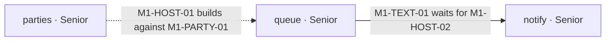

# `TICKETS.md` — the backlog's plan, at the project root

> Opened by `/tickets` **Step 3A.2**, after the ticket files are written and before verification. `slicing.md`
> decides the epics, lanes and dependencies; this file decides how the plan is written down. Mode B never
> opens it: an ad-hoc bug is not part of the plan.

## §What it holds — the plan, never the status

`TICKETS.md` is what a second person reads to start work without asking anyone: the epics, the lanes, how
the lanes wait on each other, and who starts what on day one. It replaces `docs/issues/README.md`.

- **Status lives on GitHub** — the issues and the Delivery Board — **and never in `TICKETS.md`**: no status
  column, no checkbox, no done mark, no progress count, no issue state. A plan that tracks status goes stale
  the day a ticket merges and nobody edits it; one that never tracks it cannot. `/build` never writes
  `TICKETS.md`, and no ticket lists it in its Target Files.
- **Written by `/tickets` alone.** A re-run rewrites it from the confirmed proposal; nothing else edits it.
- **One file for the whole backlog**, every milestone in it, in `#Plan` order.
- **A stopped run** (`MECHANISMS.md` §Declined runs) leaves its one dated `_Not run …_` line at the top of
  this file, and the next attempt replaces that line.

## §The sections, in order

1. **A one-line header** saying the file is the plan and naming where status lives (the board's title).
2. **One section per milestone**, named from `#Plan`: a table of its epics — epic ID and name · lane · owner ·
   tickets in build order (ID and title). A milestone with no tickets gets one line saying why (`slicing.md`).
3. **Lanes** — the parallel table (`slicing.md` §Lanes are modules): lane · owner · epics · which lanes run at
   the same time.
4. **Coordination points** — every cross-lane dependency, one line each, in its kind: *waits for … to merge*
   (that ticket's `Depends On`) or *builds against …* (its `Builds against`).
5. **Hub files** — each with the lanes that touch it.
6. **The flow graph** (§The flow graph).
7. **Day 1 — who starts what** (§Day 1).
8. **Handed to later phases** — each `#Plan` item a later phase owns, with the point it runs at.

## §The flow graph

A Mermaid `flowchart LR` with **one box per lane** — every lane in the parallel table, no box that is not a
lane — and one arrow per coordination point, from the lane that goes first to the lane that needs it:
- **Solid arrow** `-->` = **wait for the merge** — the label reads *"<ticket> waits for <ticket>"*.
- **Dotted arrow** `-.->` = **build against the contract**, a stub is enough to start — the label reads
  *"<ticket> builds against <ticket>"*.

Write it in the shapes shown below and no others: a box is `lane_<name>["<name> · <owner>"]` (the `lane_`
prefix keeps a module called `end` from breaking the parser), an arrow is `lane_a -->|"label"| lane_b` or
`lane_a -.->|"label"| lane_b`, one per line. GitHub renders Mermaid with a pinned version that has rejected
newer syntax, and a graph that does not render is a code block nobody reads. Say the legend in one line under it.

## §Day 1 — who starts what

One row per lane: the **Seat** that sits there (`SR1` unless the user named seats at the proposal), the lane,
the ticket that seat starts on day one, and why it does not wait. **A day-1 ticket has no `Depends On`** — it
may build against a contract, never wait for a merge. A lane with nothing startable on day one gets a row
saying what it waits for, so a spare seat knows not to sit there yet. It is the starting plan, not a live
one: after day one, who sits where is the board's Seat field.

## §Example

An invented waitlist app with three module lanes, two seats named at the proposal:

````markdown
# Tickets — Waitlist

> The plan: epics, lanes, and who starts what. Status lives on GitHub, on the *Waitlist — Delivery Board*,
> and never in this file.

## M1 — Parties wait for a table

| Epic | Lane | Owner | Tickets in build order |
|---|---|---|---|
| `M1-PARTY` Parties join the list | parties | Senior | `M1-PARTY-01` guest adds their party · `M1-PARTY-02` guest sees their place · `M1-PARTY-03` guest leaves the list |
| `M1-HOST` Host runs the queue | queue | Senior | `M1-HOST-01` host sees the queue · `M1-HOST-02` host seats a party · `M1-HOST-03` host marks a no-show |
| `M1-TEXT` Guests get a text | notify | Senior | `M1-TEXT-01` guest gets a text when their table is ready · `M1-TEXT-02` host sees a text that failed |

## Lanes

| Lane | Owner | Epics | Runs alongside |
|---|---|---|---|
| parties | Senior | `M1-PARTY` | queue, notify |
| queue | Senior | `M1-HOST` | parties |
| notify | Senior | `M1-TEXT` | parties |

## Coordination points

- `M1-HOST-01` (queue) builds against `M1-PARTY-01` (parties) — the `Party` type is frozen; a stub list is enough.
- `M1-TEXT-01` (notify) waits for `M1-HOST-02` (queue) to merge — the text is sent when a host seats a party.

## Hub files

- `src/app/routes.ts` — parties, queue and notify each add one line.

## Flow graph



Solid arrow: wait for the merge. Dotted arrow: build against the contract — a stub is enough to start.

## Day 1 — who starts what

| Seat | Lane | Starts | Why it does not wait |
|---|---|---|---|
| SR1 | parties | `M1-PARTY-01` guest adds their party | depends on nothing |
| SR2 | queue | `M1-HOST-01` host sees the queue | builds against `M1-PARTY-01` with a stub |
| — | notify | nothing on day one | `M1-TEXT-01` waits for `M1-HOST-02` to merge |

## Handed to later phases

- Phone-width and slow-network checks → `/test`, once `/dev-check` closes M1.
````
