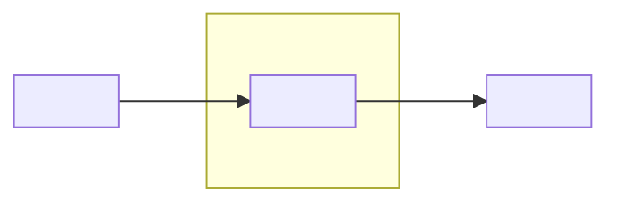
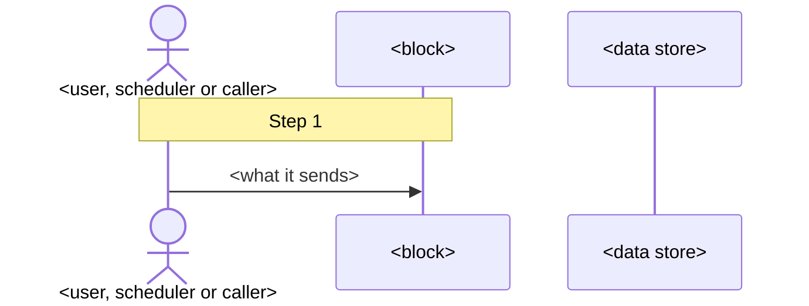

# Architecture — <product name>

> <!-- Keep this status block in the filled document; fill the placeholders. -->
> **Status:** `draft | approved by <owner> on <YYYY-MM-DD> | superseded by <link>` · written `<YYYY-MM-DD>` from the
> vision, scope and plan. **Owner:** read Overview, What drives the design, Decisions (its first line lists the defaults
> waiting for your confirmation), Monthly cost and Risks and open questions. **Developers and coding agents:** all of it;
> start with Rules the code must keep. Long forms of decisions live in `docs/adr/`. An accepted ADR replaces a decision
> here only when it names that decision; this document is then updated the same day. The workings are the appendix.

<!-- HOW TO FILL THIS TEMPLATE (delete every comment when you write the file)
1. Every `##` section below is ALWAYS present, in this order, with this heading, so any reader (person or agent) finds
   things in the same place in every project. Write `Not applicable: <reason>` for the WHOLE section only when none of it
   applies; otherwise fill what applies and mark single rows or lines `Not applicable: <reason>`. A fact nobody knows yet
   is not "not applicable": it is an open question Q# with what we assume until then.
2. Size: the body (from `## Overview` to the end of `## Risks and open questions`, counted in UTF-8 bytes with tables
   and diagrams) aims at 20,000-32,000 bytes; a small product may be shorter - never pad. Guide per section: Decisions
   up to 7,000 · How it works and AI part up to 4,000 each · Building blocks, Running it and Risks up to 3,000 each ·
   every other section up to 2,000. If it runs long, merge failure rows with the same handling and cut repetition;
   NEVER drop a rule, a decision's Rejected line or a failure row with its own handling, and NEVER compress into
   shorthand. Appendix A is word for word and does not count; Appendices B-D together stay under 6,000 bytes (shorten C
   first).
3. Plain words in full sentences a newcomer can read aloud: no slash-joined word lists ("edit/reject/approve"), no
   dropped verbs, no private abbreviations. A term a newcomer would not know is explained where it first appears or in
   `## Conventions and terms`.
4. Numbers come in three kinds. A FACT (price, version, release date, a vendor limit) points to the Appendix B or D line
   holding its link; each URL appears once in the appendix. A fact from the owner's own vision, scope or plan names that
   document (`scope`) instead of a link. A TARGET or SETTING we choose (a timeout, a cap, a budget)
   names the C# or A# it serves. An ESTIMATE says `(estimate)` and shows its working. Never write a number that is none
   of these. Every number has its unit; every date is YYYY-MM-DD.
5. Every summary-table row and every D# traces to a constraint (C1 ...) or an owner answer (A1 ...). A default that no
   answer asked for traces to the constraint it serves. A safety, correctness or quality measure that no answer asked
   for is a DERIVED constraint (`C7 (derived)`) with an open question Q# asking the owner to confirm it. Anything that
   traces to nothing is gold-plating: remove it.
6. Two mermaid diagrams always: the context diagram in `## Overview` and the main flow in `## How it works, step by
   step`. A third only when a record has more than 5 states (a state diagram under `## Data`) or more than 2 parts run
   separately (a deployment diagram under `## Running it`). No other diagrams.
7. No LaTeX. No absolute local paths. No product, vendor or library that no search or owner answer named.
8. KIND PROFILES. The summary table's first row names every kind this product is:
   - web app: people use it in a browser.
   - SaaS: many customer organisations share one running product.
   - API: programs other than the product's own screens call it.
   - AI application: code fixes the order of steps and a model fills one or more of them.
   - AI agent: the model chooses which tool or step runs next. Agent or application is itself a decision (a D#).
   - mobile app · CLI · library · scheduled job (runs on a clock) · pipeline (runs when data arrives on a queue or
     stream).
   A kind applies when it is how the product mainly runs or is used: a web app with one clean-up job inside it is a web
   app, not a scheduled job (the job is a line under **Other flows**). Each kind the product is adds the labelled lines below to the section named, placed directly after that section's
   last table. If the section already has a line with that label, extend that line instead of adding a second one. A
   kind the product is not adds nothing. Choose the kinds from the recorded vision, scope and plan; never ask a new
   question - if unsure, choose and add a Q#.
   - web app: (Security and privacy) **Sessions:** where they live, how long, how one is ended. (Running it)
     **Browsers and screens:** what is supported.
   - SaaS: (Data) **Tenancy:** how each customer's data is kept apart - database rows, files, caches, search, traces and
     any agent memory - where that is enforced, and the test that uses two customers. **Customer exit:** how one
     customer's data is exported and deleted. (Security and privacy) **Accounts:** who creates an organisation (sign-up,
     an administrator or a directory sync), invites and removes people. (Running it) **Plans and limits:** how it is
     paid for (self-service, contract, internal or none), the limits per customer, what stops one customer slowing or
     spending for the others.
   - API: (Building blocks) **API contract:** style, versioning rule, error format, where the full specification lives.
     (Running it) **Rate limits:** per caller, and what a caller sees at the limit.
   - AI application: all of `## AI part`.
   - AI agent: all of `## AI part`, plus there: **Loop limits:** most steps, time and cost per run, checked before each
     model or tool call, and what happens at each limit. **Acts as:** whose authority and credentials the agent uses in
     other systems, their scopes, where tokens live, how they are revoked. **Untrusted input:** which text the model reads
     that an outsider can write, and what keeps it data rather than instructions. **Stop switch:** who can stop the agent
     (all customers, one customer), whether running work stops, what happens to an action already started.
     **Reversible:** which actions can be undone and how; which cannot, and the approval they need first (an approval
     names the exact action, target and values, and expires). **Memory:** what it keeps between steps and runs, where,
     for how long, scoped to whom. **Hand-over:** when it stops and asks a person, which person, through which channel,
     and what happens if nobody answers. **Disclosure:** where a person sees that a text or action came from the AI.
     **Several agents:** who coordinates them and how limits and permissions pass to each, or `Not applicable: one
     agent`.
   - mobile app: (Data) **Offline and sync:** what works offline, how conflicts are settled. (Running it) **Release:**
     store review, minimum OS versions, how an old version still in use is handled.
   - scheduled job: (Data) **Input contract:** which file or table, its format and version, how completeness is known,
     what happens when it is missing, late, corrected or has a bad row (skip, quarantine, fail the run). **Run record:**
     the entity holding run id, input identity, status and checkpoint; whether a repeat replaces or versions the output.
     (Running it) **Started by:** schedule, time zone (and daylight-saving change), maximum run time, overlap rule,
     missed-run and catch-up rule, who reruns it. **Deadline:** when it must finish, and the alert when it has not
     started or finished. **Backfill:** how a past period is rerun. **Volume:** rows or files per run, and how memory
     stays bounded (streaming, chunks).
   - pipeline: (Data) **Delivery:** at-least-once or exactly-once, ordering, duplicates, where a failing message goes
     (dead letter). (Running it) **Backlog:** the alert when work piles up.
   - CLI or library: (Building blocks) the Interfaces table is the public API or the commands with their exit codes.
     (Running it) **Release:** supported language or OS versions, how a breaking change is released and announced.
9. CLEAR FOR A PERSON AND AN AI AGENT. Later phases' agents build from this file, so write it to be read literally:
   - One name per thing: a block is called by its folder name (`billing/`) everywhere - text, tables, diagrams.
   - IDs: C constraint · R rule · Step N · D decision · I interface · RK risk · Q open question · A owner answer. Each ID
     is defined once.
   - Each fact has ONE home: a MUST or NEVER only in `## Rules the code must keep`; a choice, its trade-off and the
     options that lost only in `## Decisions`; a constraint's number only in `## What drives the design`. Elsewhere,
     write a few plain words for the reader and the ID (`EU only (C3)`) - never a different value or meaning.
   - A RULE protects a C# or D# and has a test that fails when it breaks; it uses MUST or NEVER. A CONVENTION makes code
     uniform and is enforced by a type, formatter or linter; it never uses MUST or NEVER.
   - No filler that leaves the reader guessing: no open-ended lists, no "maybe", no "TBD". An unknown is a Q#.
   - Name the noun instead of "it" or "this" when two things could be meant.
-->

## Overview

<!-- 3-5 plain sentences a newcomer understands: what the product is, who or what uses it (people, a schedule, another
system, a calling program), its shape (how many parts run, where; whether work runs in the request, in a background task
or in a separate worker), and the one or two ideas the whole design rests on. Then the context diagram and the summary. -->

<3-5 sentences.>

| Area | Choice | Why, in one line (C# / A#) | D# |
|---|---|---|---|
| Kind of product | <one or more kinds from rule 8> | | |
| Language and framework | | | |
| Where it runs | | | |
| Data store | | | |
| <the areas this product has: login, user interface, AI model, queue, public API ...> | | | |

<!-- The first four rows always; then one row per area this product really has (2-6 rows). Never a row just to write
"Not applicable". The Choice cell is 2-6 words; the decision itself lives in its D#. -->

## What drives the design

<!-- 4-10 constraints (derived ones included), the most decisive first, each with its source (the vision, scope or plan, or A#). One C per hard
promise of the product. The team (people, hours a week, languages), money a month, how much infrastructure they will
run, lock-in accepted and where data must stay may share one or two Cs. A quality target (speed, volume, uptime, data
loss allowed) states its conditions and threshold; one nobody stated is `(derived)` with a Q#. -->

| # | Constraint | Number | Source | Proven by |
|---|---|---|---|---|
| C1 | <e.g. every figure in an approved reply is exact> | <0 wrong figures> | <vision> | <the check before any draft is shown + the known-answer set in CI> |

<!-- `Proven by` is `-` for a fact about the team or money that the product does not promise. -->

**Out of scope for this architecture:** <the non-goals and deferred items from the scope that the design must NOT build
for, one line each>.

## Rules the code must keep

<!-- The invariants every change must respect, 4-10, each a MUST or NEVER sentence. An agent changing the code reads
this section first. Each rule names where it comes from, the block that enforces it, and the test that fails if it
breaks; a rule nothing enforces yet says so and has a risk RK#. -->

| # | Rule | From | Enforced by [block] | Proven by |
|---|---|---|---|---|
| R1 | <e.g. The model NEVER computes an amount; every amount in a draft comes from `figures/`, tied to its source line.> | <D1, C1> | <the check before any draft is shown [`drafts/`]> | <the test that fails if it is broken> |

## How it works, step by step

<!-- The flow that produces the product's main output, from what starts it to its final observable outcome: 5-10 steps.
If a person approves before the product acts, the approval is a step and the action and its confirmed outcome follow;
if the approval completes the product's job, it is the last step. Not the login handshake (that is in
`## Security and privacy`) and not health checks. Each step: WHO does it (a person, a block, code or the model), WHAT it
does, WHAT IS CHECKED before the next step, and where in the code it happens. Then the same flow as a sequence diagram;
put a note `Step N` at each step, including a check that has no arrow (mermaid's own arrow numbers are not the steps).
Other flows the product needs (cancel, delete, rerun) are one line each after the failure table. -->

1. **<Actor> <does what>** [`<block>`: <route, command or function>]. <what is checked; what is stored>.
2. ...

**When a step fails:**

| Step | What can go wrong | What the product does | What the user or operator sees |
|---|---|---|---|
| <n> | <e.g. the external system is down or slow> | <retry once, then fallback / hold / refuse> | <message or alert> |

<!-- One row per external call and per named check (one that blocks, holds or falls back); group rows only when the
product does the same thing and the person sees the same thing. A crash after something was stored is its own row: what
is stored, and whether repeating the step is safe. -->

**Other flows:** <cancel · delete · rerun · ...: one line each, with the block that handles it>.

## Building blocks

<!-- The product's own modules (3-8 rows): domain modules such as `billing/`, `reports/`, `audit/`, never generic
scaffolding such as `src/`, `tests/`, `infra/`. They become the project's folders. A block that keeps no data writes `-`
under Owns. Other blocks reach a block only through its interfaces. -->

| Block | Responsible for (in plain words) | Owns (data it may change) | Calls (I# or block, in-process · queue · HTTP) |
|---|---|---|---|
| `<module>/` | | | |

**Interfaces:**

| # | Interface (route, command, function, event, file) | Called by | In → out | Errors the caller can rely on | Sync or async | Who may call |
|---|---|---|---|---|---|---|
| I1 | | | | | | |

<!-- Every interface another block, a person's screen or an outside caller uses: 3-12 rows. The full request and response
shapes live in the contracts document; this table names them so nobody invents one. -->

**External systems, each behind an adapter:**

<!-- An external is a system the product calls and does not own: a vendor API, the identity provider, a mail, payment or
model service. The product's own data store, managed or not, is part of the product and is described in `## Data` and
`## Running it`, not here. Each external gets an adapter interface so it can be swapped and tested without the vendor. -->

| External | Used for | Adapter interface | Timeout · retry · if it is down | Stand-in for local work and CI | How to replace it |
|---|---|---|---|---|---|
| | | `<InterfaceName>` | | <a fake, a container, a recorded reply> | |

## Data

<!-- The main entities (3-10): where each lives, how sensitive it is now and when real data arrives, how long it is kept
and how it is deleted. Then the states of each record that changes state (1-3 records), the rules that keep data
consistent, and what leaves the boundary. -->

| Entity | Key fields and links | Sensitivity now → with real data (public · internal · personal · special category) | Stored in | Kept for · deleted how |
|---|---|---|---|---|
| | | | | |

**States of `<record>`:** `<state> → <state> → <state>`; which block and which person may move it, and what is refused
(e.g. approving twice, approving a stale edit).
**Consistency:** <what is written in one transaction · the key that makes a repeat safe · what happens when two people
or two runs act at once (lock, version check) · what is done when a call to an external system timed out after it may
have acted>.
**What leaves the boundary:** <external · which fields · why · never sent: which fields>.
**Schema changes:** <migration tool; how a migration is reviewed and rolled back>.

## Conventions and terms

<!-- How every module writes the same thing the same way (4-10 rows), then the domain words a newcomer must know
(3-8 terms). -->

| Concern | Convention | Enforced where |
|---|---|---|
| <money · time and time zone · identifiers · language, number format and where user-facing text lives · error shape · log fields · configuration keys (in `.env.example`, named after their adapter)> | <e.g. amounts are integer cents; formatting happens only when shown> | <a type, a formatter, a linter, a test> |

**Terms:** **<term>** - <plain meaning>. · ...

## Decisions

<!-- First line: the defaults the owner has not confirmed. Then one block per load-bearing decision, 4-10, the most
consequential first: technology choices AND the system's own principles. `user-chosen` only when an owner answer names
the option itself; an answer that states a constraint the option satisfies makes it `default taken, not user-chosen`.
A decision that creates a rule writes `Rule: R#` and does not restate it. -->

**Defaults waiting for the owner's confirmation:** <D2 · D4 · ...> (or `none`).

### D1. <the decision, in one sentence>
- **Why:** <C# / A#, in one or two sentences>.
- **Trade-off we accept:** <what this makes harder or more expensive>.
- **Rejected:** <option> - <why it lost> · <option> - <why it lost>.
- **Revisit when:** <a trigger: "more than 50 users", "real data arrives", "milestone M3", "the price passes EUR X">.
- **Rule:** <R# | none> · **ADR:** <[ADR-NNNN](adr/NNNN-<slug>.md) | inline> · **Provenance:** <user-chosen | default
  taken, not user-chosen>

## Security and privacy

<!-- Who or what can do what, and how each promise is enforced IN CODE OR CONFIG, not only in a prompt or a policy. Keep
a promise at the lowest layer that can hold it (a read-only database role beats a read-only tool, which beats a sentence
in a prompt). Name a law or standard only with its source and the specific obligation. -->

| Concern | How it is handled | Enforced by (layer) |
|---|---|---|
| Identity of people (login, and what a local developer uses instead) | | |
| Identity of the running process (the account or role it runs as) | | |
| Who can do what (roles, least privilege) | | |
| Secrets (where they live locally and in production; the scan that stops a committed one) | | |
| Data protection (in transit, at rest, residency) | | |
| Audit trail (who did what, when) | | |

| Top threat (2-5) | What we do | Enforced by |
|---|---|---|
| | | |

## AI part

<!-- Only for a product with a model in it; otherwise the one line `Not applicable: no model in the product`. A line
that does not apply to this model is `Not applicable: <reason>`. -->

- **What the model does, and what it never does:** <e.g. explains figures; never computes, sends or changes data>.
- **Actions and their tiers:** read · write within a limit · needs approval · forbidden (no tool exists). The table is
  here, or the link to the ADR holding it; `Not applicable: the model calls no tools` when it has none.
- **Model and runtime:** <model id, released YYYY-MM-DD, region or endpoint> · max_tokens · timeout · thinking effort ·
  retry and fallback · caching · streaming.
- **Cost per use:** for one <use> = every model call it makes, retries included:
  `(uncached input × input price + cached input × cached price + output incl. thinking × output price) / 1,000,000`
  per call, prices per 1M tokens in <currency>. Give the typical use and the worst case (at the loop limit), against
  <C#>. Say how spend is metered, whether the cap is checked before each call, and what happens to work in progress at
  the cap.
- **Guardrails in code:** <the R# that stand between the model and the user>.
- **How it is checked:**

| Check | When it runs | Pass bar |
|---|---|---|
| Runtime gates | every use | |
| Known-answer set (n cases) | every prompt or model change, in CI | |
| Human review | each milestone or pilot | |

- **Prompt versions and tracing:** <where prompts live; the version written to every trace; the tracing tool>.
- **If the model is down or wrong:** <fallback model (and the checks it passed), hold for a person, or a plain error>.

## Running it

<!-- Where each part runs, how a change ships, what is watched, recovery and the monthly cost. Choose environments and
recovery from what a failure would cost, how sensitive the data is and how risky a release is - and say what is
deliberately left out. A library or a mobile app ships through a release channel: fill **Release** instead of hosting. -->

| Part | Runs on (host, region) | Network (public, private) | Runs as (identity) | Data in it |
|---|---|---|---|---|
| <one row per part that runs in production> | | | | |

<!-- Local work uses the same parts; add a `<part> (local)` row only where local uses different technology. -->

- **Started by:** <requests · a schedule · a queue · a caller>.
- **First day:** <the README section or command that installs, loads sample data or a sample input, and starts it
  locally, with the stand-in for every external system>.
- **Ship a change:** <checks in CI → merge → deploy · how to roll back · which stand-ins CI uses and when a real external
  call runs (if ever)>.
- **Tooling:** <dependency manifest + lockfile · formatter and linter · type checker · test runner · commit hooks · secret
  scanner · task runner · CI>.
- **Watched:** <logs: only the log fields in `## Conventions and terms`, never secrets or unneeded personal data · the
  2-4 numbers on a dashboard · each alert and who gets it>.
- **Backup and recovery:** <what is backed up, how often · data loss allowed and time to recover (a C#) · how a restore
  is tested · who restores>.
- **Monthly cost:**

| Item | Plan or size | <currency> a month | Source |
|---|---|---|---|
| | | | |
| **Total** | | | against <C#> |

**Deliberately left out for now:** <e.g. a staging environment, autoscaling, a second region> - <the trigger that brings it in>.

## Mapping to the plan

<!-- Each milestone of the plan, the architecture pieces it needs by then, and the decisions it may reopen. Without a
plan: `Not applicable: no milestones recorded`. -->

| Milestone | Needs from the architecture | Decisions it may reopen |
|---|---|---|
| M1 | | |

## Risks and open questions

| # | Risk | Likelihood · impact | What reduces it | Watched by |
|---|---|---|---|---|
| RK1 | | | | |

| # | Open question | Who answers | Needed by | Until then we assume | Blocks (nothing · build · release · real data) |
|---|---|---|---|---|---|
| Q1 | | | | | |

---

## Appendix A — Owner's answers

<!-- Each question in short, then the answer word for word, under a stable ID (A1, A2 ...). -->

## Appendix B — Search list

<!-- One line per search: `- <decision> · <query> · what it settled · <link to the page you opened, never a homepage>` -->

## Appendix C — Options considered

<!-- The options shown to the owner before the question, one line each: option · what it is · cost to run · lock-in ·
version, date and link (why each lost is in `## Decisions`, not here). For an agent product, the framework table goes under `### Framework options` (3-4 options, at least one
beyond the usual examples). Do not repeat the Rejected lines of `## Decisions`. -->

## Appendix D — Sources and what is not verified

<!-- Links the body relies on that Appendix B does not already hold (each URL once), official pages first. Then
`**Not verified:**` - each claim resting on a blog, a search summary or an estimate, and the step that will verify it. -->
